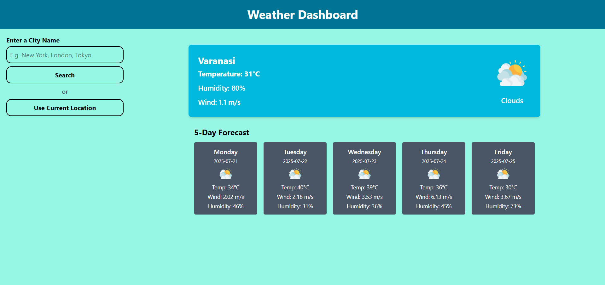

# 🌦️ Weather Forecast Dashboard

A clean, responsive, and beginner-friendly weather forecast application built using **HTML**, **JavaScript**, **Tailwind CSS**, and the **OpenWeatherMap API**. Easily check the current weather and 5-day forecast for any city or your current location!

---

## 📸 Preview



---

## 🔧 Features

- 🔍 Search weather by **city name**
- 📍 View weather using **current location**
- 🗂️ **Recent city dropdown** stored using `localStorage`
- 📆 **5-day forecast** (with temperature, humidity, wind)
- 🎯 Real-time weather icons and condition display
- 🖥️ **Responsive design** for desktop, tablets, and mobile
- 🚫 Graceful **error handling**
- 🎨 Styled using **Tailwind CSS**

---

## 🛠️ Technologies Used

| Technology       | Description                          |
|------------------|--------------------------------------|
| HTML             | Markup structure                     |
| JavaScript       | Core logic, DOM, API calls           |
| Tailwind CSS     | Utility-first styling framework      |
| OpenWeatherMap   | Weather data via REST API            |
| Geolocation API  | Get user's current location          |
| LocalStorage     | Store recent searched cities         |
| Git & GitHub     | Version control and hosting          |

---

## 🚀 Getting Started

### 1. Clone the Repository

```bash
git clone https://github.com/Krishn77777/Weather_Forecast.git
cd Weather_Forecast
